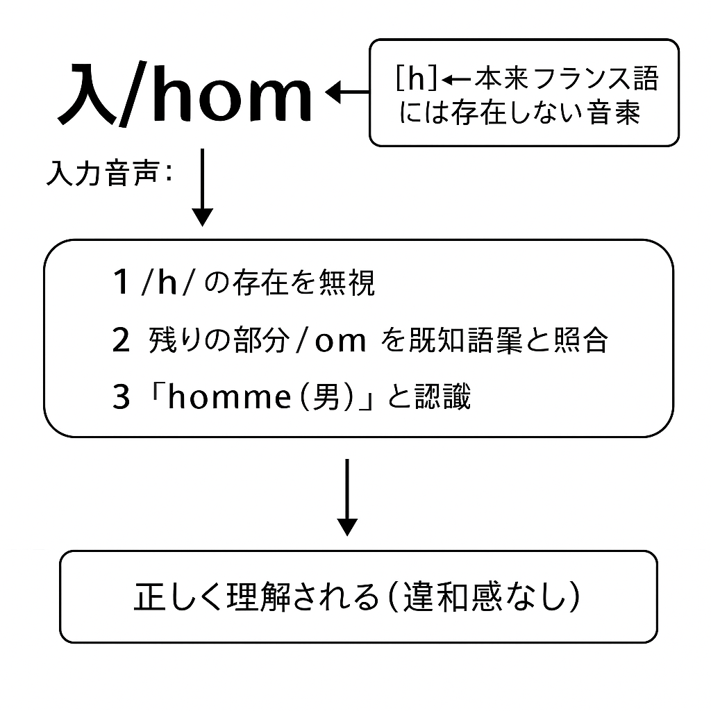

# hの扱い

## hの扱い

### 基本方針
- **Fonelはフランス語の発音やリエゾンのパターンを学習者が意識できるよう設計されている。**
- 特に、**フランス語の“有音のh”（h aspiré）**は実際には発音されないにもかかわらず、**リエゾンやエリジオンを妨げる役割**を持つため、学習上非常に紛らわしい。
- Fonelではこれを記憶補助のため、**h aspiré を実際に発音するものとして綴り・発音に反映する**。
  - 例：*héro* → Fonelでは **héro**（/he.ʁo/）と表記・発音することで、リエゾンが起きないことを明示。

### 脱落の許容
- 一方で、**フランス語では h aspiré(有音のh)はその名前に反してそもそも発音されない**ため、
**口語的な再現や省略のスタイルが重要な場面では、Fonelでも h 音を脱落させることを許容する**。
- その際、視覚的に h の省略を示す目的で、**h をアポストロフ（'）に置き換えることがある**。
  - 例：*un héros* → Fonel標準：**ë héro**（/ə he.ʁo/）、口語許容形：**ë 'éro**（/ə e.ʁo/）

### 外国語話者の発音との関係

- フランス語母語話者の多くは、/h/ 音を音素として認識していないため、**外国語話者が /h/ を発音してしまっても不自然に感じることは少ない**。
- 実際、英語話者などが [h] を発音しても、多くのフランス語話者はそれに気づかず、**意味理解や会話の流れに支障をきたすことはほとんどない**。
- Fonelにおいても、**意図的に /h/ を発音する設計は、誤解を生むのではなく、むしろリエゾンの可否を明示する役割を果たす**。

> このため、h を強調して発音しても、過度に不自然とされることはなく、Fonelの記述方針と矛盾しない。

## 外国語話者の /h/ 発音に対する仏語話者の認識

<!--

-->

---

## Fonelにおける「有音のh」と「無音のh」の対比

| 種類                    | フランス語における特徴                           | Fonelでの扱い                                        | 
|-------------------------|--------------------------------------------------|------------------------------------------------------|-
| **無音のh**（h muet）   | - 発音されない - リエゾン・エリジオン**可能** | - h は表記に使わない - リエゾンが反映される       | 
| **有音のh**（h aspiré） | - 発音されない - リエゾン・エリジオン**不可** | - h を綴り・発音で表現（記憶補助） - 口語で脱落可 | 

> 備考：
> - Fonelでは学習支援の観点から、有音のhをあえて発音記号付きで表記することで、「リエゾンが起きない単語」であることを視覚的・聴覚的に明確にする。
> - 無音のhはリエゾンするため、Fonelでもリエゾン後の形（音も含む）を積極的に再現する。

## 有音のhを含む単語の例一覧

### 無音の h（h muet）

| Fonel        | 発音(IPA)          | cf. Fransè     | 意味         |
|--------------|--------------------|----------------|--------------|
| òm           | ɔm                 | homme          | 男           |
| êr           | œʁ                 | heure          | 時、時間     |
| ótel         | o.tɛl              | hôtel          | ホテル       |
| òner         | ɔ.nœʁ              | honneur        | 名誉         |
| istuar       | is.twaʁ            | histoire       | 物語、歴史   |
| ivèr         | i.vɛʁ              | hiver          | 冬           |
| ópital       | o.pi.tal           | hôpital        | 病院         |
| armòni       | aʁ.mɔ.ni           | harmonie       | 調和         |
| abitüd       | a.bi.tyd           | habitude       | 習慣         |
| èrb          | ɛʁb                | herbe          | 草           |
| ümanité      | y.ma.ni.te         | humanité       | 人類         |
| ümur         | y.muʁ              | humour         | ユーモア     |
| üzaj         | y.zaʒ              | usage          | 使用         |
| emisfèr      | e.mi.sfɛʁ          | hémisphère     | 半球         |
| élis         | e.lis              | hélice         | プロペラ     |
| éróism       | e.ʁo.ism           | héroïsme       | 英雄性       |
| èktar        | ɛk.taʁ             | hectare        | ヘクタール   |
| érisi        | e.ʁe.zi            | hérésie        | 異端         |
| ót           | ot                 | hôte           | 宿主、主人   |
| éritié       | e.ʁi.tje           | héritier       | 相続人       |

### 有音の h（h aspiré）

| Fonel        | 発音(IPA)          | cf. Fransè     | 意味         |
|--------------|--------------------|----------------|--------------|
| héro         | he.ʁo              | héros          | 英雄         |
| haricó       | ha.ʁi.ko           | haricot        | インゲン豆   |
| hibu         | hi.bu              | hibou          | フクロウ     |
| hérisõn      | he.ʁi.sɔ̃          | hérisson       | ハリネズミ   |
| hérõn        | he.ʁɔ̃             | héron          | サギ         |
| hüt          | hyt                | hutte          | 小屋         |
| hamstèr      | ham.stɛʁ           | hamster        | ハムスター   |
| hãndicap     | hɑ̃.di.kap         | handicap       | 障害         |
| haïr         | ha.iʁ              | haïr           | 憎む         |
| hõnt         | hɔ̃t               | honte          | 恥           |
| hazar        | ha.zaʁ             | hasard         | 偶然         |
| haĉ          | haʃ                | hache          | 斧           |
| hãngar       | hɑ̃.ɡaʁ            | hangar         | 倉庫         |
| harem        | ha.ʁɛm             | harem          | ハーレム     |
| hat          | hat                | hâte           | 急ぎ         |
| hóz          | hoz                | hausse         | 上昇         |
| halt         | halt               | halte          | 停止         |
| havr         | havʁ               | havre          | 港           |
| hènir        | hɛ.niʁ             | hennir         | いななく     |
| hóbwa        | ho.bwa             | hautbois       | オーボエ     |

### h の脱落とリエゾン禁止の保持（Fonel特有のルール）

Fonelではすべての文字 **h** は原則として /h/ として発音される。
これは Fonel がフランス語学習補助を目的とするため、フランス語における **リエゾンの可否を記憶上明示的に保つため**である。
しかし、口語においては発音の簡略化として **h の脱落** が許容される。

---

h の脱落はFona(Fonel-B)では推奨されない。
Franel(Fonel-Fr)においてはより柔軟に運用されており、仏語互換の口語表現としてh の脱落がより広く行われる傾向にある。

